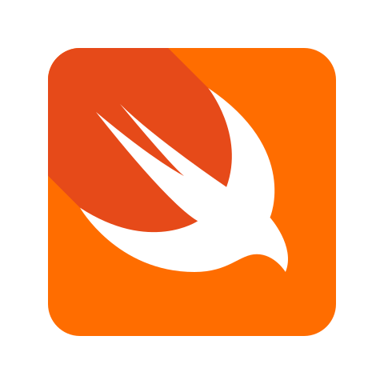

## 👋 Hi there! My Name is Abdullah Ihsan

- 👨‍💻 I'm a Mobile Application Developer from Islamabad, Pakistan.
- 🏫 Bachelors in Software Engineering from FAST-NUCES Islamabad.
- 👀 I work mainly in Flutter, Swift, SwiftUI and Java.
- 🚀 I’m currently exploring Swift and SwiftUI.
- 📫 How to reach me [LinkedIn](https://www.linkedin.com/in/abdullah-ihsan-187aa819b/) | [Email](mailto:abdullah.ihsan3@gmail.com).

### ⚡ Tools and Technologies

  
  &nbsp; &nbsp;
  
  &nbsp; &nbsp;
  
  &nbsp; &nbsp;
  
  &nbsp; &nbsp;
  
  &nbsp; &nbsp;
  
  &nbsp; &nbsp;
  
  &nbsp; &nbsp;
  
  &nbsp; &nbsp;
  
  &nbsp; &nbsp;
  
  &nbsp; &nbsp;

